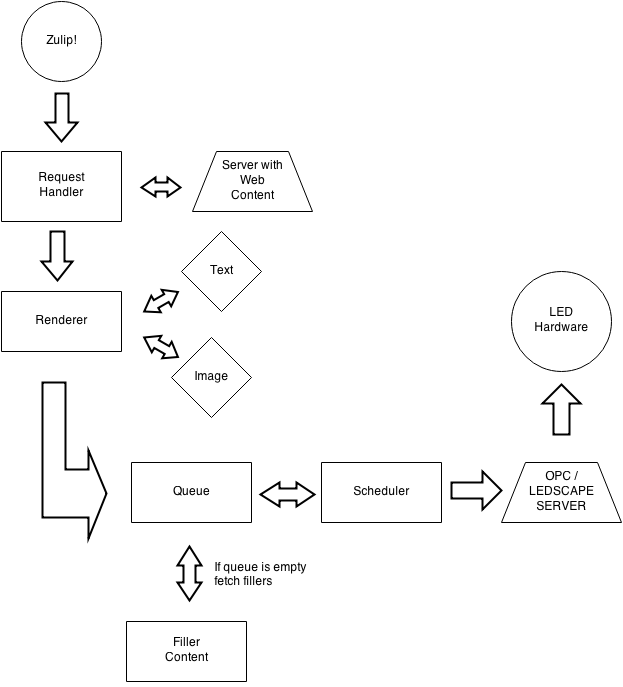

LED Bot
=========


A LED application server. Stream images, messages and more to LEDs in your home, office, hacker space.

Currently pipeline is working, supports to commands.

| command                              | parameters         |
| ------------------------------------ | ------------------ |
| ```led-bot show-image <imagename>``` | image needs to be on the same server & directory where bot is running.  |
| ```led-bot show-text <text>```       | maximum of [1000](https://github.com/marqsm/LED-bot/blob/master/textRenderer.py#L12) characters  |

## Installation instructions

The [hardware](https://github.com/marqsm/LED-bot/wiki/Build---Hardware) and
[software](https://github.com/marqsm/LED-bot/wiki/Build---Software)
installation instructions are on the
[Wiki](https://github.com/marqsm/LED-bot/wiki)

The wiki also has more information about the software architecture and other
things!




Created at [Hacker School](https://hackerschool.com), Summer 2014
