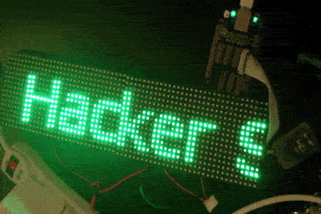

LED Bot
=========



A LED application server. Stream images, messages, emoji and more to LEDs in your home, office, hacker space.

Currently pipeline is working, supports to commands.

| command                              | parameters         |
| ------------------------------------ | ------------------ |
| ```led-bot show-image <image-url>``` | An image url  |
| ```led-bot show-text <text>```       | maximum of [1000](https://github.com/marqsm/LED-bot/blob/master/textRenderer.py#L12) characters  |

At the moment LEDbot accepts input from [Hacker School's](https://hackerschool.com) internal chat system, Zulip, but it shouldn't hard to add other inputs (SMS, IRC, Slack, Web, etc). [Take a look at the code](https://github.com/marqsm/LED-bot/blob/master/LEDBot/bot_scheduler.py#L252) and write another listener!

Output is [Open Pixel Control](http://openpixelcontrol.org/).

## Installation instructions

The [hardware](https://github.com/marqsm/LED-bot/wiki/Build---Hardware) and
[software](https://github.com/marqsm/LED-bot/wiki/Build---Software)
installation instructions are on the
[Wiki](https://github.com/marqsm/LED-bot/wiki)

The wiki also has more information about the software
[architecture](https://github.com/marqsm/LED-bot/wiki/Architecture) and other
things!

## Goals

This project aims to be AWESOME to contribute to, especially for new Hacker
Schoolers.  To begin contributing, look at the long list of
[issues](https://github.com/marqsm/LED-bot/issues) we have!

## Authors

Created at [Hacker School](https://hackerschool.com), Summer 2014
